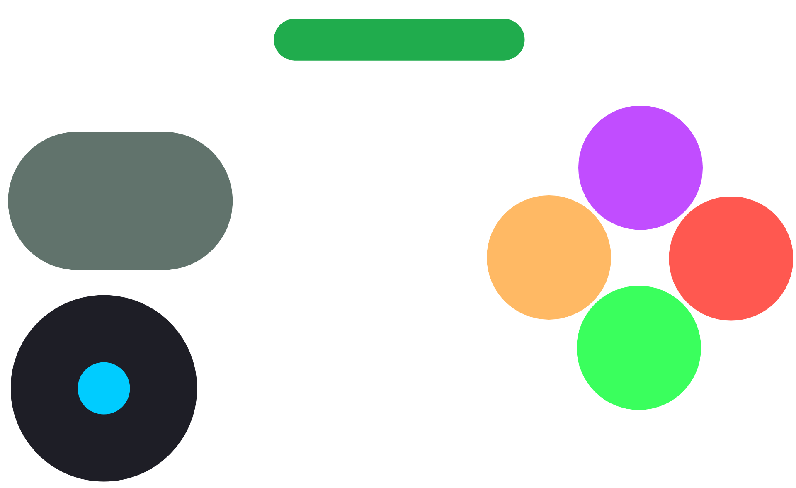
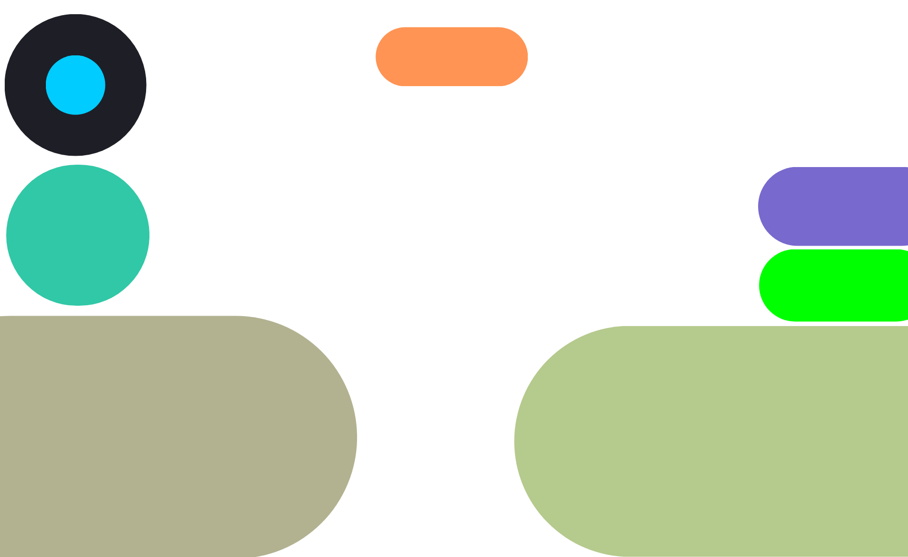
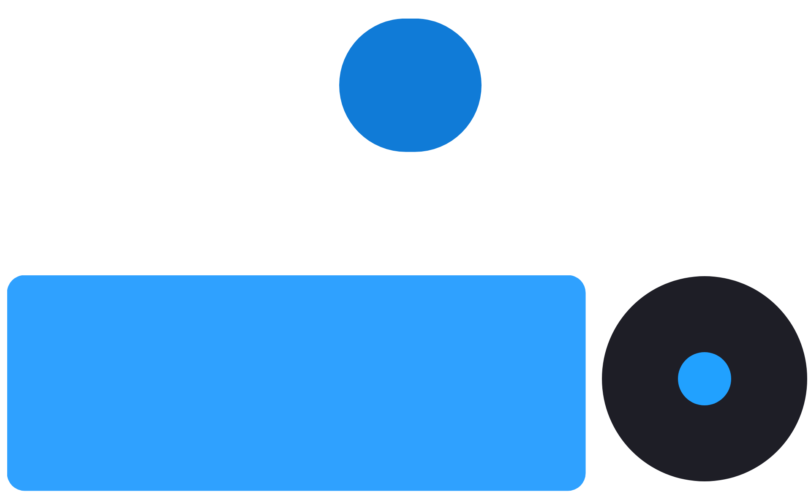
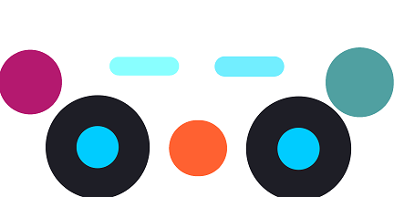
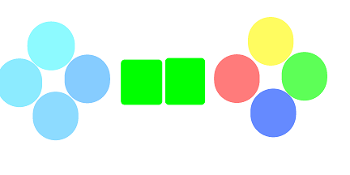
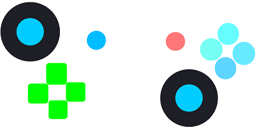
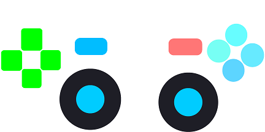

# 🎮 Gamepad XO / XO+ Import Collection

<!-- <p align="center">
  
</p> -->

<p align="center">
  Ready-to-import premium gamepad layouts for <b>Gamepad XO</b> and <b>Gamepad XO+</b>
</p>

<p align="center">
  
  
  
  
</p>

# 📖 Overview

This repository contains professionally designed custom gamepad profiles that can be imported directly into:

- **<a href="https://play.google.com/store/apps/details?id=com.offlinew.gplt">Gamepad XO</a>**
- **<a href="https://play.google.com/store/apps/details?id=com.offlinew.gppro">Gamepad XO+</a>**

### These layouts are optimized for Mobile games, Android TV gaming, Cloud gaming, Emulator gameplay, Touch-to-controller conversion, Motion & sensor-based controls (XO+)

### Each profile is carefully tuned for Comfortable thumb reach, Reduced accidental taps, Low latency control placement, Better ergonomics for long sessions, Landscape gameplay optimization

# 🕹️ XO vs XO+

| Feature | <a href="https://play.google.com/store/apps/details?id=com.offlinew.gplt">Gamepad XO</a> | <a href="https://play.google.com/store/apps/details?id=com.offlinew.gppro">Gamepad XO+</a> |
|---|---|---|
| Buttons | ✅ | ✅ |
| D-Pad | ✅ | ✅ |
| Analog Sticks | ✅ | ✅ |
| Triggers (L2/R2) | ✅ | ✅ |
| Custom Layouts | ✅ | ✅ |
| Gyroscope Controls | ❌ | ✅ |
| Motion Steering | ❌ | ✅ |
| Sensor Mapping | ❌ | ✅ |
| Advanced Input Actions | ❌ | ✅ |


# 📥 Import Instructions

### Step 1 — Download Layout

Download any `.json.svg` profile from the repository.

### Step 2 — Open App

Open:
- **<a href="https://play.google.com/store/apps/details?id=com.offlinew.gplt">Gamepad XO</a>**
or
- **<a href="https://play.google.com/store/apps/details?id=com.offlinew.gppro">Gamepad XO+</a>**

### Step 3 — Import

Navigate to:

```text
Custom Gamepads
   └── Import
```

Select the downloaded `.json.svg` file.

### Step 4 — Start Playing

The gamepad layout will instantly appear in your custom layouts.


# 🎮 Gamepad Collection
### Game specific Gamepads
| screenshot | Game | Gamepad description |
|---|---|---|
|  | BombSquad | layout designed specifically for fast-paced multiplayer combat in BombSquad |
|  | Mars | A clean minimalist layout focused on fast tap response and comfortable |
|  | Orbia | A highly refined precision-focused layout optimized for rhythm timing and accurate touch gamepad |

### Generic gamepads
| screenshot | Gamepad Description |
|---|---|
|   | Symmetric minimalistic gamepad with two sticks |
|   | Minimalistic gamepad with D-pad in left and A,B,X,Y in right |
|   | Generic Gamepad with Left Stick above D-pad |
|   | Generic Symmetric minimalistic gamepad with two sticks left Stick below D-pad |


<!--
# 🧭 XO+ Sensor Layouts

Sensor layouts are exclusive to **Gamepad XO+**.

These layouts can use:
- Gyroscope
- Accelerometer
- Motion steering
- Device tilt
- Dynamic motion triggers

# 🧠 Sensor Features

| Sensor Feature | Gamepad XO+ |
|---|---|
| Tilt Steering | ✅ |
| Gyroscope Aim | ✅ |
| Motion Racing Controls | ✅ |
| Dynamic Movement Mapping | ✅ |
| Sensor Deadzone Control | ✅ |
-->


# 🛠 Creating Your Own Layout

You can create your own layouts inside:
- Gamepad XO
- Gamepad XO+

Then export them as `.json.svg` & logo as `.json.png` files and share them in this repository.

# 🤝 Contributions

Contributions are welcome.

You can contribute:
- New layouts
- Better ergonomic designs
- Sensor-based profiles
- Game-specific presets
- Improved thumbnails
- Documentation improvements


# 📜 License

This repository is intended for sharing custom controller layouts for educational and gaming purposes. Game assets, logos, and trademarks belong to their respective owners.

<p align="center">
    
</p>
<p align="center">
  Built for the Gamepad XO community ❤️
</p>
